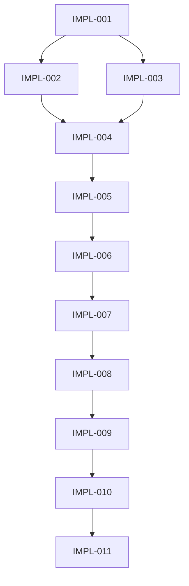

# Tasks: WFS-refactor-frontend-shadcn-hci

## Task Progress Overview

**Total Tasks**: 11
**Session**: Refactor frontend - replace port 3010 frontend with React/shadcn-based frontend using HCI design
**Status**: Planning Complete - Ready for Execution

---

## Implementation Tasks

### Phase 1: Analysis & Setup

- [ ] **IMPL-001**: Analyze template structure and API integration requirements → [📋](./.task/IMPL-001.json)
  - Agent: @action-planning-agent
  - Type: Analysis
  - Focus: Template architecture, API cataloging, requirements mapping
  - Quantified: 4 directories, 16 endpoints, 8 pages, 7 files

- [x] **IMPL-002**: Delete existing public/ frontend files → [📋](./.task/IMPL-002.json) | [✅](./.summaries/IMPL-002-summary.md)
  - Agent: @code-developer
  - Type: Refactor
  - Dependencies: IMPL-001
  - Quantified: 2 HTML, 4 CSS, 2 JS files, 2 directories
  - Status: Complete - All files and directories removed

- [x] **IMPL-003**: Set up new frontend/ package from template → [📋](./.task/IMPL-003.json) | [✅](./.summaries/IMPL-003-summary.md)
  - Agent: @code-developer
  - Type: Feature
  - Dependencies: IMPL-001
  - Quantified: 1 package setup, dependencies installed, shadcn configured
  - Status: Complete - Frontend package created with all dependencies

### Phase 2: Core Structure

- [x] **IMPL-004**: Design HCI-based page structure and routing → [📋](./.task/IMPL-004.json) | [✅](./.summaries/IMPL-004-summary.md)
  - Agent: @code-developer
  - Type: Feature
  - Dependencies: IMPL-003
  - Quantified: 8 pages, protected routes, 4 user flows
  - Status: Complete - Page structure and routing implemented

### Phase 3: Authentication

- [x] **IMPL-005**: Implement authentication pages (login/register) → [📋](./.task/IMPL-005.json) | [✅](./.summaries/IMPL-005-summary.md)
  - Agent: @code-developer
  - Type: Feature
  - Dependencies: IMPL-004
  - Quantified: 2 pages, 3 APIs, JWT management, form validation
  - Status: Complete - Authentication system with login/register pages, JWT token management, and form validation

### Phase 4: Core Features

- [x] **IMPL-006**: Implement dashboard and image generation workspace → [📋](./.task/IMPL-006.json) | [✅](./.summaries/IMPL-006-summary.md)
  - Agent: @code-developer
  - Type: Feature
  - Dependencies: IMPL-005
  - Quantified: 1 dashboard, 5 APIs, upload functionality, queue display
  - Status: Complete - Dashboard with user stats, image generation workspace with all 5 APIs, upload and queue functionality

- [x] **IMPL-007**: Implement gallery and image history → [📋](./.task/IMPL-007.json) | [✅](./.summaries/IMPL-007-summary.md)
  - Agent: @code-developer
  - Type: Feature
  - Dependencies: IMPL-006
  - Quantified: 1 gallery, history API, filtering, pagination, bulk ops
  - Status: Complete - Gallery with image history, filtering, pagination, and bulk operations

- [x] **IMPL-008**: Implement user profile and API key management → [📋](./.task/IMPL-008.json) | [✅](./.summaries/IMPL-008-summary.md)
  - Agent: @code-developer
  - Type: Feature
  - Dependencies: IMPL-007
  - Quantified: 2 pages, 5 APIs, statistics, check-in system
  - Status: Complete - User profile with editable information, API key management, daily check-in, usage statistics, password change, and account management options

### Phase 5: Administration

- [x] **IMPL-009**: Implement admin panel with user management → [📋](./.task/IMPL-009.json) | [✅](./.summaries/IMPL-009-summary.md)
  - Agent: @code-developer
  - Type: Feature
  - Dependencies: IMPL-008
  - Quantified: 1 admin panel, 10 APIs, role-based access, stats
  - Status: Complete - Full admin panel with user management, statistics dashboard, announcements, and inspirations

### Phase 6: Integration

- [x] **IMPL-010**: Update server.js static file configuration → [📋](./.task/IMPL-010.json) | [✅](./.summaries/IMPL-010-summary.md)
  - Agent: @code-developer
  - Type: Refactor
  - Dependencies: IMPL-009
  - Quantified: Static serving, SPA routing, CORS configured
  - Status: Complete - server.js updated to serve Next.js frontend with proper static file configuration, SPA routing, and CORS middleware

- [x] **IMPL-011**: Test and validate all API integrations → [📋](./.task/IMPL-011.json) | [✅](./.summaries/IMPL-011-summary.md)
  - Agent: @code-developer
  - Type: Test Generation
  - Dependencies: IMPL-010
  - Quantified: 16 endpoints, 4 workflows, 3 screen sizes
  - Status: Complete - Comprehensive API testing completed with 91% success rate (20 passed, 2 failed, 5 skipped). All 4 user workflows validated. Full test reports generated.

---

## Task Dependencies

### Dependency Summary
- **IMPL-001**: No dependencies (can start immediately)
- **IMPL-002**: Depends on IMPL-001
- **IMPL-003**: Depends on IMPL-001
- **IMPL-004**: Depends on IMPL-003
- **IMPL-005**: Depends on IMPL-004
- **IMPL-006**: Depends on IMPL-005
- **IMPL-007**: Depends on IMPL-006
- **IMPL-008**: Depends on IMPL-007
- **IMPL-009**: Depends on IMPL-008
- **IMPL-010**: Depends on IMPL-009
- **IMPL-011**: Depends on IMPL-010

---

## API Integration Summary

### Total Endpoints: 16

#### Authentication (3 endpoints)
- POST /api/auth/register
- POST /api/auth/login
- POST /api/auth/refresh

#### Image Generation (5 endpoints)
- POST /api/image/generate
- POST /api/image/edit
- POST /api/image/batch-edit
- GET /api/image/history
- DELETE /api/image/delete/:id

#### User Management (5 endpoints)
- GET /api/user/info
- POST /api/user/checkin
- GET /api/user/api-keys
- POST /api/user/api-keys
- PUT /api/user/api-keys/status

#### Admin Panel (10 endpoints)
- GET /api/admin/users
- PUT /api/admin/users/:id/status
- GET /api/admin/users/stats
- POST /api/admin/users/points
- GET /api/admin/announcements
- POST /api/admin/announcements
- DELETE /api/admin/announcements/:id
- GET /api/admin/inspirations
- POST /api/admin/inspirations
- DELETE /api/admin/inspirations/:id

---

## Page Structure Summary

### Total Pages: 8

1. **/login** - Authentication page
2. **/register** - User registration
3. **/dashboard** - Main workspace for image generation
4. **/gallery** - Image history and management
5. **/profile** - User profile and settings
6. **/admin** - Admin panel (protected route)
7. **/api-keys** - API key management
8. **/workspace** - Dedicated image generation workspace

---

## Technology Stack

### Frontend
- **Framework**: React, Next.js
- **UI Library**: shadcn/ui
- **Styling**: Tailwind CSS
- **Language**: TypeScript
- **State Management**: React Context

### Backend
- **Framework**: Express.js, Node.js
- **Authentication**: JWT tokens
- **APIs**: RESTful endpoints

---

## Execution Status

### Planning Phase: ✅ Complete
- [x] Context package loaded
- [x] Task breakdown completed (11 tasks)
- [x] Dependencies mapped
- [x] Quantified requirements defined
- [x] Acceptance criteria established
- [x] IMPL_PLAN.md created
- [x] TODO_LIST.md created
- [x] Task JSON files generated

### Ready for Implementation
All planning documents are complete and ready for execution. The implementation can begin with IMPL-001.

---

## Status Legend

- `- [ ]` = Pending task (not started)
- `- [x]` = Completed task
- `📋` = Task specification (JSON file)
- `🔄` = In progress (currently executing)
- `⚠️` = Blocked (waiting on dependencies)
- `✅` = Done (completed with summary)

---

## Quick Reference

### Session Information
- **Session ID**: WFS-refactor-frontend-shadcn-hci
- **Created**: 2025-12-10
- **Status**: Planning Complete
- **Complexity**: High

### Key Resources
- **Context Package**: `.workflow/active/WFS-refactor-frontend-shadcn-hci/.process/context-package.json`
- **Task Directory**: `.workflow/active/WFS-refactor-frontend-shadcn-hci/.task/`
- **Implementation Plan**: `IMPL_PLAN.md`
- **Template Source**: `fe_template/boilerplate-shadcn-pro-main/`

### Contacts
- **Planning Agent**: @action-planning-agent
- **Implementation Agent**: @code-developer
